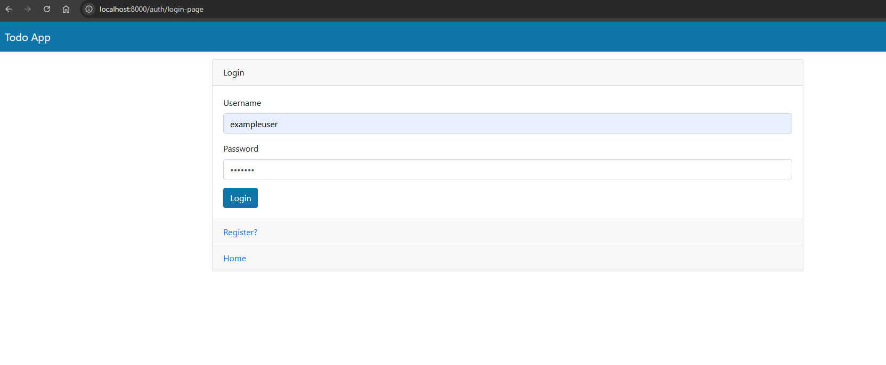
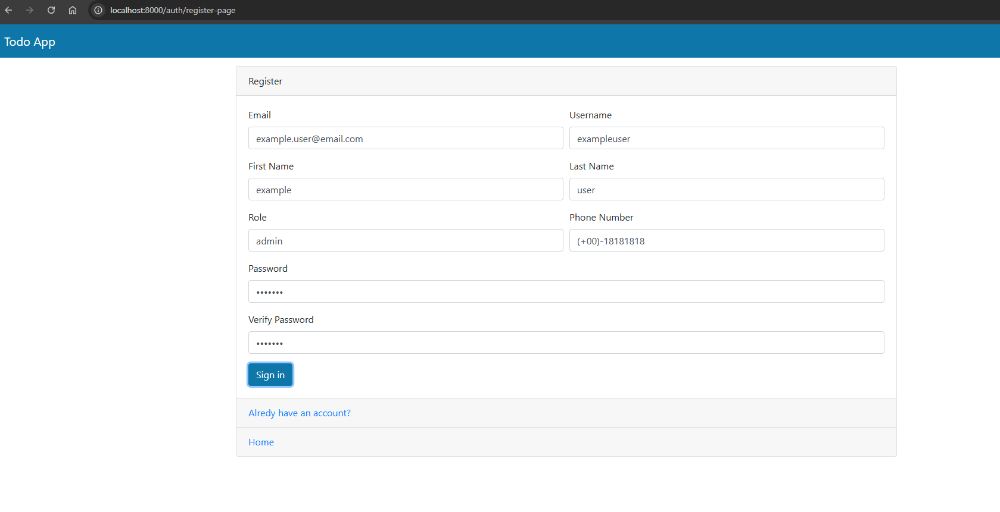
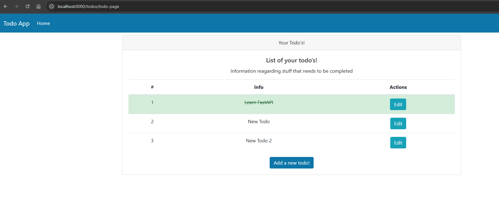
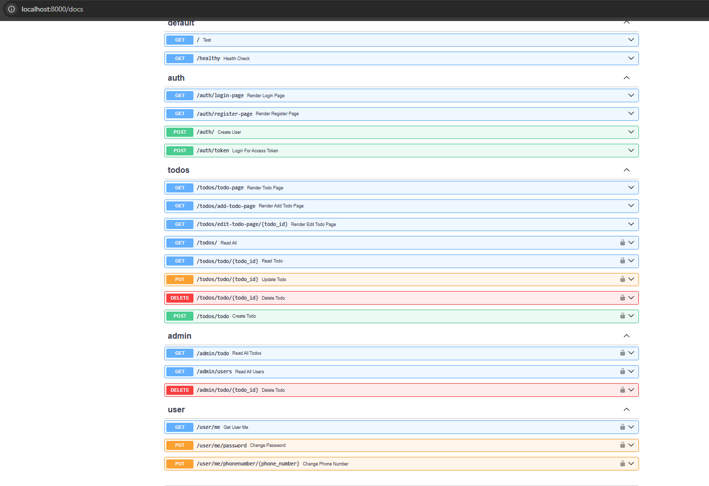
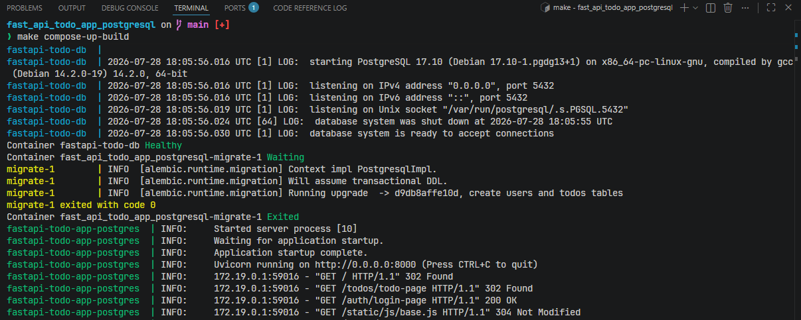
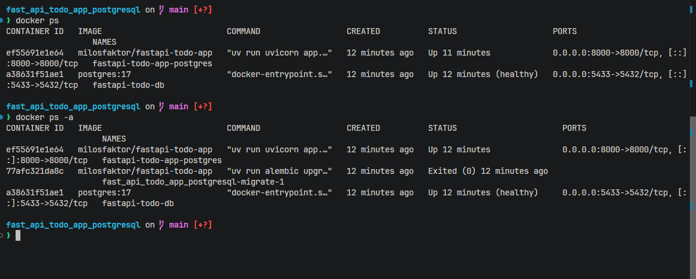
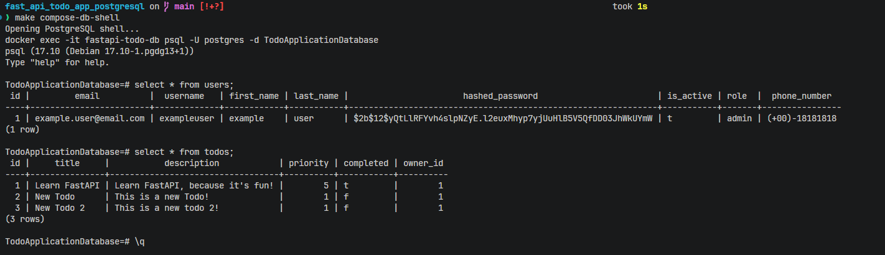

# FastAPI Todo App

A full-stack Todo application built with FastAPI, SQLAlchemy, Jinja2 templates, Bootstrap 4, JavaScript `fetch()`, JWT authentication, and Alembic migrations.

This project started as a course-based FastAPI application and was then cleaned up with environment-based configuration, separated SQLAlchemy models and Pydantic schemas, centralized database dependencies, Alembic schema creation, and a focused test suite.

## Quick Links

- [Run locally](#run)
- [Run with Docker Compose](#docker-compose)
- [Screenshots](#screenshots)

## Screenshots

### Login



### Register



### Todo Page



### FastAPI Docs



### Docker Logs



### Running Containers



### PostgreSQL Container Data



## Features

- User registration and login
- JWT access tokens stored in browser cookies
- Protected todo pages
- Create, read, update, and delete todos
- Mark todos as completed
- User profile endpoints
- Change password and phone number
- Admin endpoints for reading users/todos and deleting todos
- Server-rendered HTML with Jinja2
- Bootstrap 4 UI styling
- JavaScript form handling with `fetch()`
- SQLite/PostgreSQL/MySQL-ready configuration
- Alembic migrations
- Pytest test suite

## Tech Stack

- Python 3.13
- FastAPI
- SQLAlchemy
- Alembic
- Pydantic / pydantic-settings
- Jinja2
- Bootstrap 4
- JavaScript
- pytest
- uv
- Docker / Docker Compose

## Project Structure

```text
app/
  config.py        # Environment-based settings
  database.py      # SQLAlchemy engine, SessionLocal, Base, get_db
  main.py          # FastAPI app setup
  models.py        # SQLAlchemy database models
  schemas.py       # Pydantic request/response schemas
  routers/         # Auth, todo, user, admin routes
alembic/           # Database migrations
scripts/
  init_db.py       # Manual create_all() DB initializer
templates/         # Jinja2 HTML templates
static/            # CSS and JavaScript
tests/             # Pytest tests
Dockerfile         # App image definition
docker-compose.postgres.yaml
```

## Environment

The app chooses an env file using `DB_MODE`.

Supported modes:

```text
sqlite_example -> .env.sqlite.example
sqlite         -> .env.sqlite
postgres       -> .env.postgres
mysql          -> .env.mysql
```

Only `.env.sqlite.example` is committed. Real `.env*` files are ignored by Git.

Example `.env.sqlite.example`:

```env
ENVIRONMENT=sqlite_example
SQLALCHEMY_DATABASE_URL=sqlite:///./todosapp.example.db
SECRET_KEY=replace-with-openssl-rand-hex-32
ALGORITHM=HS256
```

Docker Compose uses `.env.docker.postgres.example` by default:

```env
POSTGRES_USER=postgres
POSTGRES_PASSWORD=1234!
POSTGRES_DB=TodoApplicationDatabase
ENVIRONMENT=postgres
SECRET_KEY=replace-with-openssl-rand-hex-32
ALGORITHM=HS256
```

Generate a local secret key with:

```bash
openssl rand -hex 32
```

For private local development, create your own ignored env file, for example:

```bash
cp .env.sqlite.example .env.sqlite
```

Then update `SECRET_KEY` and run with:

```bash
DB_MODE=sqlite uv run uvicorn app.main:app --reload
```

## Install

Install dependencies with `uv`:

```bash
uv sync
```

## Database Setup

### Recommended: Alembic

Run migrations against the default example SQLite database:

```bash
DB_MODE=sqlite_example uv run alembic upgrade head
```

Or use the Makefile:

```bash
make db-init-alembic
```

To create a new migration after changing SQLAlchemy models:

```bash
DB_MODE=sqlite_example uv run alembic revision --autogenerate -m "describe your change"
DB_MODE=sqlite_example uv run alembic upgrade head
```

### Simple Learning Option

This project also includes a manual SQLAlchemy initializer:

```bash
uv run python -m scripts.init_db
```

Or:

```bash
make db-init
```

Alembic is preferred for schema history. The manual initializer is kept as a simple learning/development helper.

## Run

First run the database initializer or Alembic migrations, then run the app.

Initialize with Alembic and run:

```bash
make run-with-alembic
```

Or:

Initialize with the simple SQLAlchemy script and run:

```bash
make run-with-dbinit
```

Any other run.

Start the app:

```bash
uv run uvicorn app.main:app --reload
```

Or:

```bash
make run-app
```

Then open:

```text
http://127.0.0.1:8000
```

## Docker Compose

By default, the Makefile uses:

```bash
docker compose
```

If your system uses:

```bash
docker-compose
```

pass it as a Makefile variable:

```bash
make compose-up-build DOCKER_COMPOSE=docker-compose
make compose-up DOCKER_COMPOSE=docker-compose
make compose-down DOCKER_COMPOSE=docker-compose
```

Build and start the app with PostgreSQL:

```bash
make compose-up-build
```

This uses:

```text
docker-compose.postgres.yaml
.env.docker.postgres.example
```

The Compose setup starts three services:

```text
postgres -> migrate -> fastapi
```

Startup flow:

```text
1. PostgreSQL starts
2. PostgreSQL healthcheck waits until the database accepts connections
3. Alembic migration container runs `alembic upgrade head`
4. FastAPI starts after migrations finish successfully
```

The app is available at:

```text
http://localhost:8000
```

The Docker PostgreSQL database is exposed on host port `5433`:

```bash
psql -h localhost -p 5433 -U postgres -d TodoApplicationDatabase
```

This keeps it separate from a local PostgreSQL server using `localhost:5432`.

Open a PostgreSQL shell inside the Docker container:

```bash
make compose-db-shell
```

Stop containers but keep the database volume:

```bash
make compose-down
```

Stop containers and remove the database volume:

```bash
make compose-down-v
```

Use `compose-down-v` carefully because it deletes the Docker PostgreSQL data.

For private local Docker values, create your own ignored file:

```bash
cp .env.docker.postgres.example .env.docker.postgres
```

Then run:

```bash
make compose-up-build COMPOSE_ENV_FILE=.env.docker.postgres
```

## Makefile Commands

```bash
make db-init            # Create tables using scripts/init_db.py
make db-init-alembic    # Apply Alembic migrations for SQLite example mode
make run-app            # Run FastAPI app locally
make run-with-dbinit    # Initialize DB with script, then run app
make run-with-alembic   # Apply migrations, then run app
make compose-up-build   # Build and start Docker Compose services
make compose-up         # Start Docker Compose services
make compose-up-d       # Start Docker Compose services in detached mode
make compose-down       # Stop Docker Compose services
make compose-down-v     # Stop services and remove Docker volumes
make compose-db-shell   # Open psql inside the Docker Postgres container
make test               # Run pytest in verbose mode
```

## Tests

Run tests:

```bash
uv run pytest -q
```

Or:

```bash
make test
```

Current test coverage includes auth helpers, todo CRUD endpoints, user endpoints, admin endpoints, and health/main route behavior.

## Notes

- The app uses browser cookies to store the JWT access token.
- JavaScript in `static/js/base.js` intercepts form submissions and sends API requests with `fetch()`.
- Bootstrap 4 is stored locally under `static/`.
- Database files (`*.db`), private env files, virtual environments, private notes, and Git metadata are excluded from Docker build context by `.dockerignore`.
- Real `.env*` files are ignored by Git. Keep secrets out of commits.
